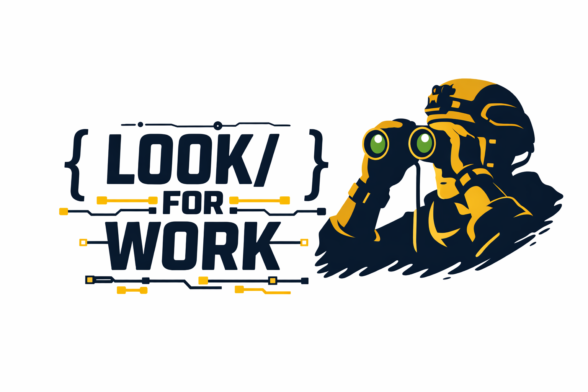

<p align="center">
  
</p>

<p align="center">
  <em>A Claude Code plugin that proactively scans your codebase for the highest-impact improvement opportunities — so you never have to wonder what to work on next.</em>
</p>

<p align="center">
  <strong>If you owned this codebase, what would you fix first?</strong>
</p>

<p align="center">
  <strong>This audit may be computational intensive, keep in your mind your context</strong>
</p>

## Installation

**Step 1** — Add the marketplace:
```
/plugin marketplace add mpge/look-for-work-claude
```

**Step 2** — Install the plugin (via the `/plugin` menu → Discover tab, or directly):
```
/plugin install look-for-work
```

## Usage

```
/look-for-work                   # Full codebase analysis
/look-for-work security          # Focus on a specific area
/look-for-work "the auth flow"   # Focus on a specific concern
```

## How It Works

Look For Work runs in 4 phases:

### Phase 1 — Reconnaissance
Explores the project structure, identifies the stack, reads docs, checks git history, and maps the critical/complex areas before dispatching analysts.

### Phase 2 — Deep Analysis (Parallel Agents)
Dispatches **6 specialized agents** simultaneously across two waves:

| Agent | What It Looks For |
|-------|-------------------|
| Architecture Analyst | Tight coupling, poor modularization, unclear boundaries, SOLID/DRY/KISS violations |
| Security Analyst | OWASP Top 10 — injection, broken auth, data exposure, insecure configs, access control |
| Performance Analyst | N+1 queries, memory leaks, blocking ops, missing caches, inefficient algorithms |
| Quality Analyst | Code smells, duplication, large functions, inconsistent patterns, refactor opportunities ranked by ROI |
| Reliability Analyst | Test coverage gaps, concurrency issues, data integrity risks, observability holes, deployment concerns |
| Landmine Detector | Subtle bugs, edge cases, non-obvious production failures, business logic risks |

Together, these agents cover **15 analysis dimensions**:

1. System Architecture & Design Integrity
2. Security & Threat Surface (OWASP Top 10)
3. Performance & Resource Efficiency
4. Test Coverage & Risk Mapping
5. Code Quality & Maintainability
6. Concurrency & Async Safety
7. Dependency & Supply Chain Risk
8. API & Interface Consistency
9. Observability & Debuggability
10. Deployment & Environment Readiness
11. Data Integrity & Validation
12. Business Logic Risk Detection
13. Hidden Landmines (production-only failures)
14. Refactor Opportunities with ROI
15. Technical Ownership Prioritization

### Phase 3 — Synthesis & Prioritization
Deduplicates findings, cross-references reinforcing issues across dimensions, and prioritizes everything into:

| Priority | Criteria |
|----------|----------|
| **P0 — Fix Now** | Security vulnerabilities, data loss risks, production landmines |
| **P1 — Fix Soon** | Performance bottlenecks, reliability gaps, critical test coverage holes |
| **P2 — Plan For** | Architecture improvements, major refactors with high ROI |
| **P3 — Backlog** | Code quality improvements, nice-to-haves, low-ROI cleanups |

### Phase 4 — Report
Delivers a structured **Codebase Health Report** including:

- Executive summary with tech debt assessment
- Prioritized findings (P0–P3) with file paths, impact, fix approach, and effort estimates
- Cross-cutting themes that appeared across multiple dimensions
- "If I Owned This Codebase" — top 5 priorities with justification
- Concrete next steps you can start on immediately

## Example Output

```
# Codebase Health Report

## Executive Summary
Generally solid Laravel app with moderate tech debt concentrated in the
payment processing module. Top concern is an unvalidated webhook endpoint.

## P0 — Fix Now
- [SECURITY] Webhook endpoint at routes/api.php:47 accepts unvalidated
  Stripe signatures — attacker can forge payment events
  → Add signature verification middleware. Effort: Small.

## P1 — Fix Soon
- [PERF] OrderController@index has N+1 on customer.address — 200 queries
  on a 200-row page load
  → Add ->with('customer.address') to the query. Effort: Small.

...
```

## Plugin Structure

```
look-for-work-claude/
├── .claude-plugin/
│   └── plugin.json                # Plugin metadata
├── commands/
│   └── look-for-work.md           # The /look-for-work slash command
├── agents/
│   ├── architecture-analyst.md    # SOLID, coupling, modularization
│   ├── security-analyst.md        # OWASP Top 10 audit
│   ├── performance-analyst.md     # Bottlenecks, N+1, caching
│   ├── quality-analyst.md         # Code smells, refactor ROI
│   ├── reliability-analyst.md     # Tests, concurrency, observability
│   └── landmine-detector.md       # Hidden bugs, edge cases
├── README.md
└── LICENSE
```

## Design Philosophy

- **Proactive, not reactive** — Don't wait for bugs to be reported. Find them.
- **Specific, not vague** — Every finding references actual code with file paths and line numbers.
- **Actionable, not academic** — Every finding includes a concrete fix and effort estimate.
- **Honest, not noisy** — If the codebase is solid, it says so. No manufactured issues.
- **Respectful** — Findings are framed as opportunities, not criticism.
- **Context-aware** — A prototype is held to different standards than a production service.

## Customization

The agents in the `agents/` directory are individually customizable. You can:

- Edit an agent's focus areas or severity criteria
- Add new agents for domain-specific analysis (e.g., accessibility, i18n, compliance)
- Remove agents you don't need
- Adjust the command's phase structure in `commands/look-for-work.md`

## Requirements

- [Claude Code](https://docs.anthropic.com/en/docs/claude-code) CLI

## License

MIT
